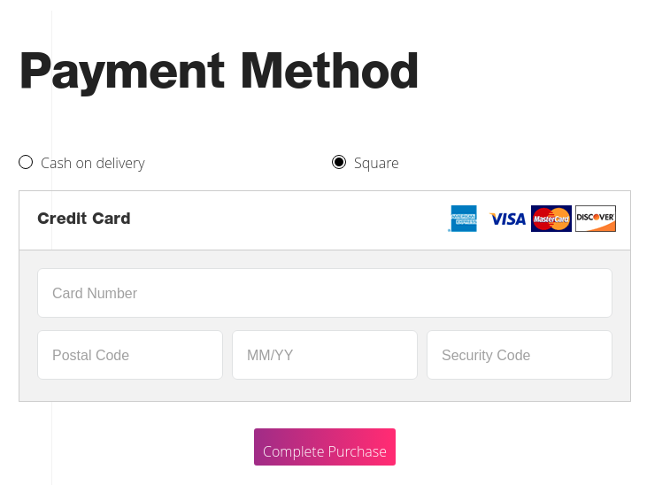

# This is the Square Payment module for Vue Storefront

Square Payment module for [vue-storefront](https://github.com/DivanteLtd/vue-storefront), by [Amandeep Singh](<as.smartdevelopers@gmail.com>).



## Installation:

```shell
$ yarn add https://github.com/amandeepsinghdhammu/vsf-payment-square
```
By hand (preferer):
```shell
$ git clone git@github.com:amandeepsinghdhammu/vsf-payment-square.git ./vue-storefront/src/modules/square
```

Add the following also to your config/local.json and configure the square credentials

```json
"square": {
  "env" : "sandbox",
  "endpoint": {
    "complete": "/api/ext/square/complete"
  },
  "paymentMethodCode": "square",
  "sandbox": {
    "locationId": "XXXXXXXXXXX",
    "applicationId": "sandbox-sqXXXXXXXXXXXXXXXXX",
    "accessToken": "XXXXXXXXXXXXXXXXXXXXXXXXXXXXXXXXXXXXXXXXXXXXXXXXXXXXX",
    "sdkUrl": "https://js.squareupsandbox.com/v2/paymentform"
  },
  "production": {
    "locationId": "XXXXXXXXXXXX",
    "applicationId": "sqXXXX-XXXXXXXXXXXXXXXXXXXXXX",
    "accessToken": "XXXXXXXXXXXXXXXXXXXXXXXXXXXXXXXXXXXXXXXXXXXXXXXXXXXX",
    "sdkUrl": "https://js.squareup.com/v2/paymentform"
  }
}
```

## Registration the Square module

Open in you editor `./src/modules/index.ts`

```js
...
import { Square } from './square'

export const registerModules: VueStorefrontModule[] = [
  ...,
  Square
]
```
## Integration the Square component to you theme
Go to `storefront/src/themes/defalt/components/core/blocks/Checkout/OrderReview.vue`

```js
import PaymentSquare from 'src/modules/stripe/components/PaymentSquare'
import MixinSquare from 'src/modules/stripe/components/MixinSquare'

export default {
  components: {
    ...
    PaymentSquare
  },
  mixins: [..., MixinSquare],
```

Then need add component instance before `<div id="checkout-order-review-additional-container">` to template section

```html
...
<payment-square v-if="payment.paymentMethod === 'square_payments'" />
<div id="checkout-order-review-additional-container">
...
```
## Backend Platform Support
Each back-end platform handles Square payment method processing in its own way. Due to this, it is difficult to support all platforms until each one has been specifically tested and accounted for. The following back-end platforms are supported.

We fully support the official [Square](https://marketplace.magento.com/square-square-omni.html) module for Magento2, use the `square_payments` as method code.
